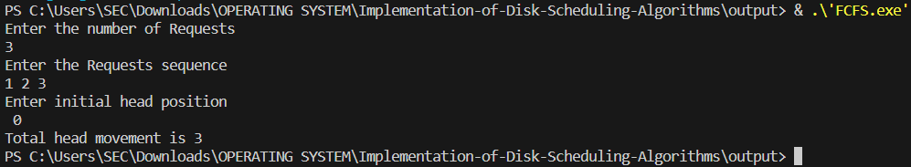
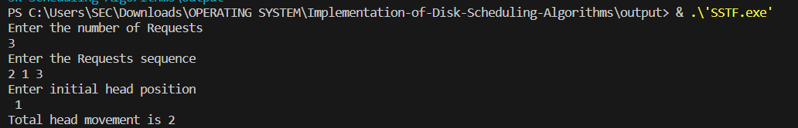
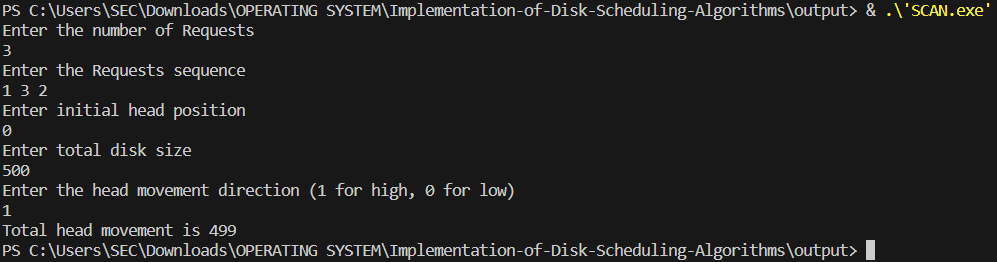
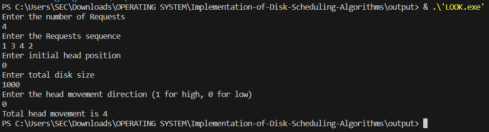

# OS-EX.11-IMPLEMENTATION-OF-DISK-SCHEDULING-ALGORITHMS
## 1.DISK SCHEDULING-FIRST COME FIRST SERVE
## Aim:
To write a program for the first come first serve method of disc scheduling.
## Description:
Disk scheduling is schedule I/O requests arriving for the disk.
It is important because: -
Multiple I/O requests may arrive by different processes and only one I/O request can be served at a time
by the disk controller. 

```c
#include <stdio.h>
#include <stdlib.h>
int main() {
    int RQ[100], i, n, TotalHeadMovement = 0, initial;
    printf("Enter the number of Requests\n");
    scanf("%d", &n);
    printf("Enter the Requests sequence\n");
    for (i = 0; i < n; i++)
    {
        scanf("%d", &RQ[i]);
    }
    printf("Enter initial head position\n");
    scanf("%d", &initial);
    for (i = 0; i < n; i++)
    {
        TotalHeadMovement += abs(RQ[i] - initial);
        initial = RQ[i];
    }
    printf("Total head movement is %d\n", TotalHeadMovement);
    return 0;
}
```
## Output:

## Result:
Thus the implementation of the program for first come first serve disc scheduling has been
successfully executed.

## 2.DISK SCHEDULING-SHORTEST SEEK TIME FIRST
## Aim:
To write a program for the first come first serve method of disc scheduling.
## Description:
Shortest seek time first (SSTF) algorithm selects the disk I/O request which requires the least disk arm
movement from its current position regardless of the direction. 
## Program:
```c
#include <stdio.h>
#include <stdlib.h>
int main()
{
    int RQ[100], i, n, TotalHeadMovement = 0, initial, count = 0;
    printf("Enter the number of Requests\n");
    scanf("%d", &n);
    printf("Enter the Requests sequence\n");
    for (i = 0; i < n; i++)
    {
        scanf("%d", &RQ[i]);
    }
    printf("Enter initial head position\n");
    scanf("%d", &initial);
    while (count != n)
    {
        int min = 10000;
        int index;
        for (i = 0; i < n; i++) 
        {
            int d = abs(RQ[i] - initial);
            if (d < min)
            {
                min = d;
                index = i;
            }
        }
        TotalHeadMovement += min;
        initial = RQ[index];
        RQ[index] = 10000;
        count++;
    }
    printf("Total head movement is %d\n", TotalHeadMovement);
    return 0;
}
```
## Output:

## Result:
Thus the implementation of the program for shortest seek time first disc scheduling has been
successfully executed.

## 3.DISK SCHEDULING-SCAN
## Aim:
To write a program for the first come first serve method of disc scheduling.
## Description:
It works in the way an elevator works, elevator moves in a direction completely till the last floor of that
direction and then turns back.
## Program:
```c
#include <stdio.h>
#include <stdlib.h>
int main()
{
    int RQ[100], i, j, n, TotalHeadMovement = 0, initial, size, move;
    printf("Enter the number of Requests\n");
    scanf("%d", &n);
    printf("Enter the Requests sequence\n");
    for (i = 0; i < n; i++)
    {
        scanf("%d", &RQ[i]);
    }
    printf("Enter initial head position\n");
    scanf("%d", &initial);
    printf("Enter total disk size\n");
    scanf("%d", &size);
    printf("Enter the head movement direction (1 for high, 0 for low)\n");
    scanf("%d", &move);
    for (i = 0; i < n; i++)
    {
        for (j = 0; j < n - i - 1; j++) 
        {
            if(RQ[j] > RQ[j + 1])
            {
                int temp = RQ[j];
                RQ[j] = RQ[j + 1];
                RQ[j + 1] = temp;
            }
        }
    }
    int index;
    for (i = 0; i < n; i++) 
    {
        if (initial < RQ[i])
        {
            index = i;
            break;
        }
    }
    if (move == 1)
    {
        for (i = index; i < n; i++)
        {
            TotalHeadMovement += abs(RQ[i] - initial);
            initial = RQ[i];
        }
        TotalHeadMovement += abs(size - RQ[i - 1] - 1);
        initial = size - 1;
        for (i = index - 1; i >= 0; i--)
        {
            TotalHeadMovement += abs(RQ[i] - initial);
            initial = RQ[i];
        }
    }
    else
    {
        for (i = index - 1; i >= 0; i--)
        {
            TotalHeadMovement += abs(RQ[i] - initial);
            initial = RQ[i];
        }
        TotalHeadMovement += abs(RQ[i + 1] - 0);
        initial = 0;
        for (i = index; i < n; i++)
        {
            TotalHeadMovement += abs(RQ[i] - initial);
            initial = RQ[i];
        }
    }
    printf("Total head movement is %d\n", TotalHeadMovement);
    return 0;
}
```
## Output:


## Result:
Thus the implementation of the program for SCAN disc scheduling has been successfully executed.

## 4.DISK SCHEDULING-LOOK
## Aim:
To write a program for the first come first serve method of disc scheduling.
## Description

It is similar to the SCAN disk scheduling algorithm except for the difference that the disk arm in spite of
going to the end of the disk goes only to the last request to be serviced in front of the head and then
reverses its direction from there only. Thus, it prevents the extra delay which occurred due to unnecessary
traversal to the end of the disk.
## Program:
```c
#include <stdio.h>
#include <stdlib.h>
int main()
{
    int RQ[100], i, j, n, TotalHeadMovement = 0, initial, size, move;
    printf("Enter the number of Requests\n");
    scanf("%d", &n);
    printf("Enter the Requests sequence\n");
    for (i = 0; i < n; i++)
    {
        scanf("%d", &RQ[i]);
    }
    printf("Enter initial head position\n");
    scanf("%d", &initial);
    printf("Enter total disk size\n");
    scanf("%d", &size);
    printf("Enter the head movement direction (1 for high, 0 for low)\n");
    scanf("%d", &move);
    for (i = 0; i < n; i++)
    {
        for (j = 0; j < n - i - 1; j++) 
        {
            if (RQ[j] > RQ[j + 1]) 
            {
                int temp = RQ[j];
                RQ[j] = RQ[j + 1];
                RQ[j + 1] = temp;
            }
        }
    }
    int index;
    for (i = 0; i < n; i++)
    {
        if (initial < RQ[i]) 
        {
            index = i;
            break;
        }
    }
    if (move == 1) 
    {
        for (i = index; i < n; i++) 
        {
            TotalHeadMovement += abs(RQ[i] - initial);
            initial = RQ[i];
        }
        for (i = index - 1; i >= 0; i--) {
            TotalHeadMovement += abs(RQ[i] - initial);
            initial = RQ[i];
        }
    } 
    else
    {
        for (i = index - 1; i >= 0; i--)
        {
            TotalHeadMovement += abs(RQ[i] - initial);
            initial = RQ[i];
        }
        for (i = index; i < n; i++)
        {
            TotalHeadMovement += abs(RQ[i] - initial);
            initial = RQ[i];
        }
    }
    printf("Total head movement is %d\n", TotalHeadMovement);
    return 0;
}
```
# Output:

## Result:
Thus the implementation of the program for LOOK disc scheduling has been successfully executed.
